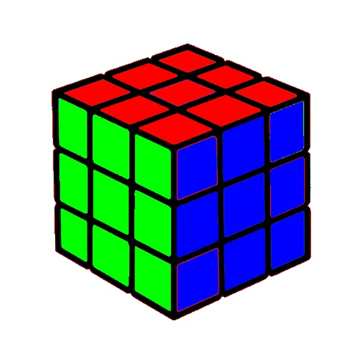

# image_processing_Assignment_29

## First Assignment
In the first exercise, we changed the color of the carrot from orange to green.

#### Input:

#### Output:

## Second Assignment
We designed the `Microsoft logo` using numpy library and play with green, red and blue color values.

#### Output:

## Third Assignment
We solved the `Rubix cubic` by using of color `split` and `merge` function that at the end we fusion the R, G, B color and we will have it.
In this exercise we had two outputs, the focus of the exercise was on the central color on each side of the Rubik's cube.

#### Input:

#### Output:

## Fourth Assignment

## Fifth Assignment
We designed color picker by using of `tkinter library`. We could design it using the `Qt` library

#### Output:

